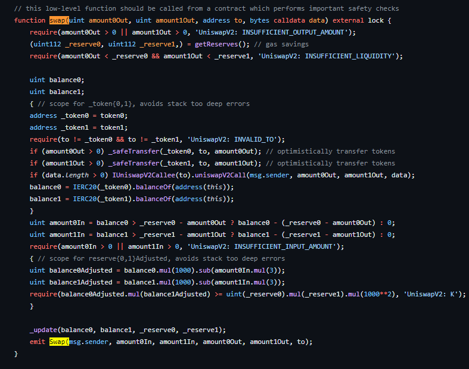

# 2024-Spring-HW2

Please complete the report problem below:

## Problem 1
Provide your profitable path, the amountIn, amountOut value for each swap, and your final reward (your tokenB balance).

> My profitable path: tokenB->tokenA->tokenD->tokenC->tokenB, tokenB balance=20.129888944077447. When tokenB->tokenA, amountIn = 5, amountOut =5.655321988655322. When tokenA->tokenD, amountIn = 5.655321988655322, amountOut =2.458781317097934. When tokenD->tokenC amountIn=2.458781317097934, amountOut=5.088927293301516. When tokenC->tokenB amountIn ==5.08892729330151, amountOut = 20.129888944077447. and the final balance is 20.129888944077447.

## Problem 2
What is slippage in AMM, and how does Uniswap V2 address this issue? Please illustrate with a function as an example.

> What is slippage in AMM? 
Slippage in AMM model is the difference between what you think you'll pay for an asset and what you actually end up paying when you make a trade.
for example in Uniswap, you want to buy something on AMM. you would like to pay
a certain price based on what you see. however, the actual price may be diffrent it is because the system works and other factors like how many people are trading and how much of that asset is available.
how does Uniswap V2 address this issue?
Uniswap V2 addresses this issue through its use of liquidity pools and the constant product formula. In Uniswap V2, liquidity providers add funds to pools that are used to facilitate trades.The formula used is  x * y = x’ * y’, where x, y: the token balances of the pool before the trade and x’, y’: the token balances of the pool after the trade.

In this swap function which is the most important logic throughout the AMM. firstly it will ensure first that there's an output amount for at least one token. then, get the current reserve in liquidity pool, after that, we need to check that it is enough liquidity in the pool to do a swap.Next, get the balance of the token anf transfet to the recipient. Then, calculate the amount0In and amound1In, both of it need to sufficient the input amount to execute the swap. after that adjust the balance to account for the slippage tehn update the reserves in liquidity pool.
in conclusion, the swap function in UniswapV2 helps mitigate slippage by ensuring that trades are executed efficiently while maintaining the integrity of the liquidity pool.

## Problem 3
Please examine the mint function in the UniswapV2Pair contract. Upon initial liquidity minting, a minimum liquidity is subtracted. What is the rationale behind this design?

> 
after I look the mint function, I think that the retionale behind this design is to keep the pool organized and easy to trade in. just imagine if uniswap V2 just make it that everyone can add only a tiny bit of liquidity, if this happen the pool becomes fragmented with many small liquidity positions, this can cause people trading not smoothly or also can cause the slippage. so, by having minimum liquidity, helps prevent fragmentation of the liquidity pool and ensures that the trading run smoothly for everyone.

## Problem 4
Investigate the minting function in the UniswapV2Pair contract. When depositing tokens (not for the first time), liquidity can only be obtained using a specific formula. What is the intention behind this?

> 
after I look the mint function, I think that the intention behind this is to make sure that the number of liquidity token that created accurately will correspond to the value of the token that have been deposited. so actually on uniswap V2 it will operate that the product of the token balances in the pool will stays the same, so this can help to get the effciency and also maintain the balance of the pool. 

## Problem 5
What is a sandwich attack, and how might it impact you when initiating a swap?

> 
First of all, what is a sandwich atatch? so this attack is like someone places their own orders around someone else's trade to make the price move against them. and because of that, it will make the trade more expensive for the victim and they get fewer tokens than they thought. or also if we check the information, A sandwich attack is a form of market manipulation where an attacker exploits a victim's high slippage tolerance, often found in large transactions on decentralized exchanges
and how might it impact you when initiating a swap?
it will impact you want make a trade. cause this attack can change the price of your trade a lot, for example someone might put their own buy and sell order around your trade, which if this happening the price will move againts you and you will getting less money than you sell or which is similar to slippage case.

